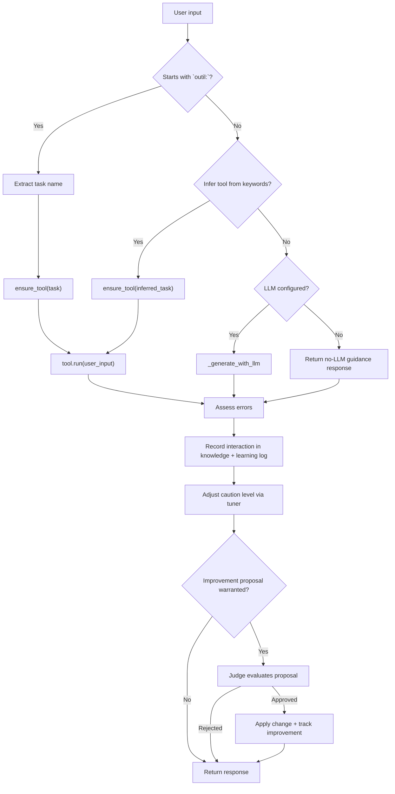

# State File

## A) Router / Decision Flow

## B) Single Sequence for a Critical Test Case

### Critical case: no LLM available → error detected → improvement gets approved

1. Input is a generic prompt (e.g. `"Explique le plan"`) that does **not** start with `outil:`.
2. Router tries keyword inference; if no tool keyword is selected for this prompt path, it checks LLM availability.
3. Because no API key/client is configured, assistant returns the fallback "Je n'ai pas de LLM configuré..." message.
4. Error assessor marks the response with `errors_detected = 1` (marker-based detection).
5. Interaction is stored in `state.knowledge` and learning log.
6. Tuner increases caution level according to detected error.
7. Improvement proposal is generated (prudence reinforcement + verification tool).
8. Judge approves proposal.
9. Assistant applies change:
   - caution level increases again by +0.05 (bounded at 1.0),
   - `verification` tool is registered if missing,
   - proposal description is appended to `improvements_applied`.
10. Final response returned to the user is still the fallback message, but state is now safer for next turns.
